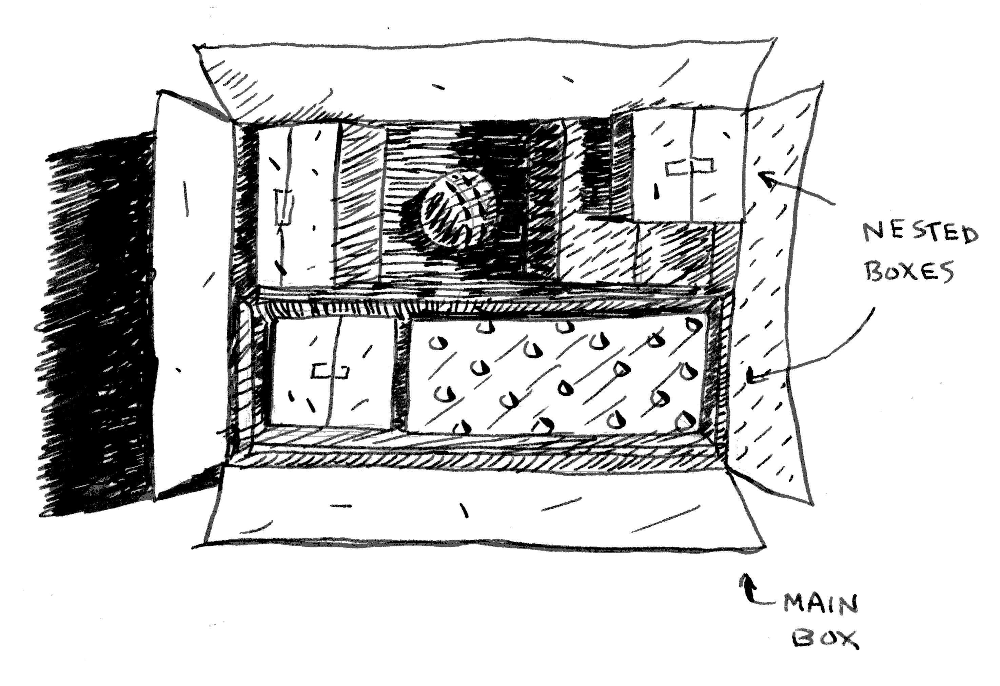

# Chapter 03 재귀

## 01. 시작하기에 앞서

의사 코드(pseudocode)란 문제와 풀이 방법을 간단한 코드 형태로 설명한 것이다. 코드처럼 보이지만 실제로는 우리가 사용하는 말과 비슷하다.

## 02. 재귀



큰 상자 속에는 작은 상자들이 있고, 그 작은 상자들 사이에는 더 작은 상자들이 있다. 열쇠는 그 상자 속 어딘가에 있다. 열쇠를 찾기 위한 알고리즘은 무엇일까?


<center>방법 1</center>

1. 내부를 확인할 상자를 쌓아놓는다.
2. 상자를 하나 집어서 내부를 살핀다.
3. 만약 안에 상자가 있다면 꺼내어 나중에 학인할 상자 더미에 놓는다.
4. 만약 열쇠가 있다면 작업 종료!
5. 반복


<center>방법 2</center>

1. 상자 안을 확인한다.
2. 만약 상자를 발견하면 1단계로 간다.
3. 만약 열쇠를 발견하면 작업 종료!

각 방법들을 코드로 확인해 보자


```python
def look_for_key(main_box):
    
    pile = main_box.make_a_pile_to_look_through()
    
    while pile is not empty:
    
        box = pile.grab_a_box()
        
        for item in box:
        
            if item.is_a_box():
                pile.append(item)
            
            elif item.is_a_key():
                print ("열쇠를 찾았어요!")
```

두 번째 방법은 재귀(recursion)을 사용한다. 재귀란 함수가 자기 자신을 호출하는 것을 말한다. 두 번째 방법을 의사코드로 쓰면 다음과 같다.


```python
def look_for_key(box):
    
    for item in box:
        
        if item.is_a_box():
            look_for_key(item)
            
        elif item.is_a_key():
            print ("열쇠를 찾았어요!")
```

재귀는 풀이를 더 명확하게 해 준다. 재귀를 쓴다고 성능이 더 나아지지는 않는다. 사실 반복문이 성능 면에서는 더 나은 경우가 많다. 하지만 프로그램에 반복문을 사용하면 프로그램의 성능을 향상시킬 수 있지만, 재귀를 사용하면 프로그래머의 능력을 향상시킬 수 있다. 

## 03. 기본 단계와 재귀 단계


```python
def countdown(i):
    print (i)
    countdown(i-1)
```

이러한 함수는 함수가 끝없이 실행되는 문제가 생긴다.


<center>**무한 반복**</center>

> \>3...2...1...0...-1...-2

이러한 문제 때문에 재귀 함수를 만들 때는 언제 재귀를 멈출지 알려줘야 한다. 그래서 모든 재귀 함수는 기본 단계(base case)와 재귀 단계(recursive case)라는 두 부분으로 나누어져 있다. 재귀 단계는 자기가 자기 자신을 호출하는 부분이다. 기본 단계는 함수가 자기 자신을 다시 호출하는 경우, 즉 무한 반복으로 빠져들지 않게 하는 부분이다.


```python
def countdown(i):
    
    print (i)
    
    if i<= 1:  # 기본단계
        return
    
    else: # 재귀단계
        countdown(i-1)
```

이제 함수가 기대한 대로 동작한다. 다음과 같이 동작한다.


<center>**무한 반복**</center>

## 04. 스택

바비큐를 만든다고 상상해 보자. 일단 바비큐를 준비하기 위한 일들을 접착식 메모지에 적어놓는다.


<center>푸시(PUSH): 가장 위에 새 항목을 추가한다. &nbsp;&nbsp; 팝(POP): 가장 위의 항목을 때어내고 읽는다.</center>

실제 할 일 목록을 사용하는 것을 살펴보면


이러한 자료구조를 스택(stack)이라 한다. 스택은 아주 단순한 자료구조이다.

### 호출 스택

컴퓨터는 호출 스택이라고 불리는 스택을 사용한다. 어떻게 사용하는지 한번 살펴보자.


```python
def greet(name):
    print ("hello, " + name + "!")
    greet2(name)
    print ("getting ready to say bye...")
    bye()
```

이 함수는 인사말을 건넨 다음 두 개의 함수를 호출한다. 여기에 그 두 함수의 코드가 있다.


```python
def greet2(name):
    print ("how are you, " + name + "?")
    
def bye():
    print ("ok bye!")
```

greet("maggie")라고 명령했다고 가정하자. 그러면 컴퓨터는 이 함수 호출을 위해 메모리 상자를 하나 할당한다.


이제 이 메모리를 사용한다. name이라는 변수의 값이 "maggie"가 되었으므로 이 값을 메모리에 저장한다.


**함수를 호출할 때마다 컴퓨터는 호출에 사용된 변수의 값을 모두 이런 식으로 저장한다.** 그 다음에는 hello, maggie! 라고 프린트한 후, greet2("maggie")명령으로 다른 함수를 호출한다. 이번에도 컴퓨터는 함수 호출에 필요한 또 다른 메모리 상자를 할당한다.


컴퓨터는 이러한 메모리 상자를 스택으로 사용한다. 두 번째 상자는 첫 번째 상자 위에 올려진 상태이다. 이제 how are you maggie? 라고 프린트하고, 함수 호출 상태에서 반환하여 돌아와야 한다. **함수가 반환되면 가장 위에 있는 상자는 팝(POP) 연산으로 인해 없어진다.**


이제 스택에서 가장 위에 있는 함수는 greet 함수가 되었다. 즉, greet 함수로 다시 돌아왔다는 뜻이다. 사실 greet2 함수를 호출하였을 때 greet 함수는 아직 완전히 실행되지 않은 상태였다.

이토록 함수를 호출하여 완전히 실행을 완료하기 전이라도 그 함수를 잠시 멈추고 다른 함수를 호출할 수 있다. 중지된 함수의 변수 값들은 모두 메모리에 저장되어 있다. greet2함수의 실행을 완료하고 나면 greet 함수로 돌아가 멈추었던 위치에서 다시 실행할 수 있다.

getting ready to say bye...라고 프린트나 다음에 bye 함수를 실행한다.


새로운 함수 호출을 위한 메모리 상자가 스택 위에 더해진다. 이제 ok bye!라고 프린트한 다음 다시 함수 호출로 돌아온다.


이제 다시 greet 함수로 돌아왔다. 더 이상 실행할 것이 없으므로 greet 함수에서도 반환되어 돌아온다. 이런 방식으로 여러 개의 함수를 호출하면서 함수에 사용되는 변수를 저장하는 스택을 호출 스택(call stack)이라고 한다.

### 재귀 함수에서 호출 스택 사용

재귀 함수도 호출 스택을 사용한다. 팩토리얼 함수가 어떻게 동작하는지 살펴보자.


```python
def fact(x):
    if x == 1:
        return 1
    
    else:
        return x * fact(x - 1)
```

이제 fact(3)을 호출하고 호출을 한줄 한줄 따라가면서 스택이 어떻게 변화하는지 살펴보자. 스택에서 가장 위에 있는 상자가 현재 호출하고 있는 fact함수를 의미한다는 것을 명심하자.


스택은 재귀에서 커다란 역할을 한다. 이 장의 시작에 있던 예제에서 열쇠를 찾는 방법은 두 가지가 있었다. 다음은 첫 번째 방법을 다시 그림으로 표현한 것이다.


이 방식을 사용하면 확인해야 할 상자의 더미를 만들고, 어떤 상자를 더 확인해야 하는지 항상 알 수 있다.


하지만 재귀적 방법에서는 상자 더미라는 것이 없다.


상자 더미가 없다면 알고리즘은 어떤 상자를 열어봐야 할까?


이 경우에 호출 스택은 다음과 같다.


확인해야 할 상자 더미는 스택에 저장되어 있다. 그림에 표시된 스택은 절반쯤 완료된 함수 호출로 이루어진 스택이고, 각각에는 확인해야 할 상자의 목록이 들어있다. 스택을 사용하면 확인해야 할 상자 더미를 일일히 추적하지 않아도 되므로 편리하다.

스택을 사용하면 편리하기는 하지만 메모리를 많이 소비한다. 모든 정보를 저장해야 하기 때문이다. 즉 함수를 호출할 때마다 메모리를 저장하고 있다는 뜻이다. 스택이 너무 커졌다는 것은 컴퓨터가 과다한 함수 호출 정보를 저장하고 있다는 뜻이다. 이렇게 되면 선택할 수 있는 방법이 두 가지이다.

- 재귀 대신 반복문을 써서 코드를 다시 작성할 수 있다.
- 고급 재귀 방법인 꼬리 재귀(tail recursion)라는 방법을 사용할 수 있다.

## 3장에서 배운 내용

- 재귀는 함수가 스스로를 호출하는 것
- 모든 재귀 함수는 기본 단계와 재귀 단계라는 두 부분으로 나누어져 있다.
- 스택에는 푸시(push) 팝(pop)이라는 두 가지 연산이 있다.
- 모든 함수 호출은 호출 스택을 사용한다.
- 호출 스택은 너무 커져서 메모리를 엄청나게 소비할 수도 있다.

# 3장 연습문제


### 3-1 이 호출 스택을 보고 어떤 정보를 알 수 있을까? 이제 재귀 함수에서 호출 스택이 어떻게 동작하는지 살펴보자.

> 다음과 같은 것을 알 수 있다.
- 처음에 greet 함수가 maggie라는 인수를 가지고 호출된다.
- 다음으로는 maggie라는 인수로 greet2 함수가 호출된다.
- 이때 greet 함수는 완료되지 않고 정지된 상태이다.
- 현재 함수 호출은 greet2 함수에 머물러 있다.
- 이 함수 호출이 완료되면 다시 greet 함수가 재개된다.

### 3-2 어쩌다가 재귀 함수를 무한 실행하게 되었다고 가정하자. 앞에서 살펴보았듯이 컴퓨터는 호출 때마다 스택에 메모리를 할당한다. 재귀 함수가 무한 실행하면 스택에는 어떤 일이 발생할까?

스택이 계속 커진다. 모든 프로그램은 호출 스택에 할당할 수 있는 공간이 제한되어 있기 때문에 이 공간을 모두 사용하면 스택 오버플로우 오류가 발생하며 종료된다.
